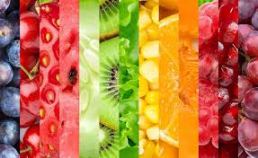

# **New Year's Resolution: 2018**
## Live Healthier
### Nicole Bohra

My goal for 2018 is to eat more fruits and vegetables and exercise more to accomplish a **healthier lifestyle**. I want to create a _plan_ for myself and also encourage my _peers_ to follow it so that they can also pursue a healthy lifestyle.

My plan of action includes:

| Task   | Description    | More Info
| :------------- | :------------- |:-----------
| Find healthy recipes       | Research recipes online that are easy to prepare and help keep our diet healthy | [Healthy Recipes](http://allrecipes.com/recipes/84/healthy-recipes/)
|Get gym Membership| Check out the best gym membership plans and sign up!|[Gym Membership Info](https://www.theseattlegym.com/gym-membership/)
|Track health data| Purchase a FitBit or any other personalized health tracking data equipment to help stay up to date about steps, heart rate, etc.|[E-Health Devices](https://www.healthit.gov/patients-families/stay-well)
